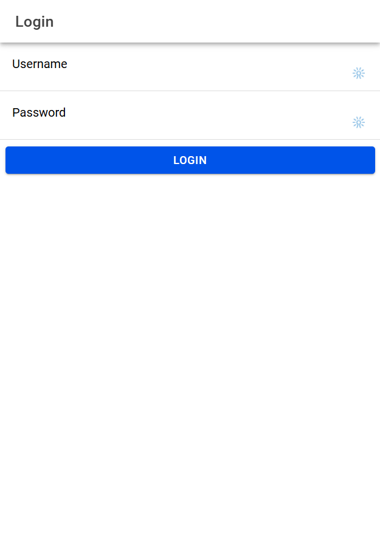
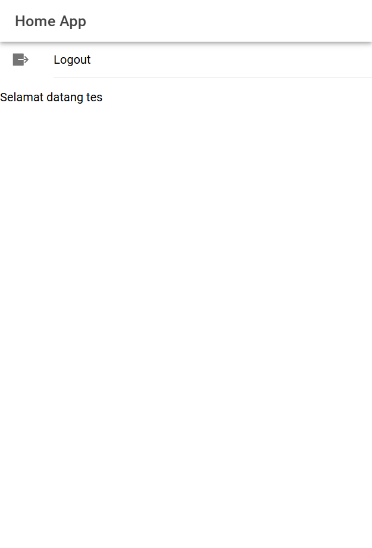
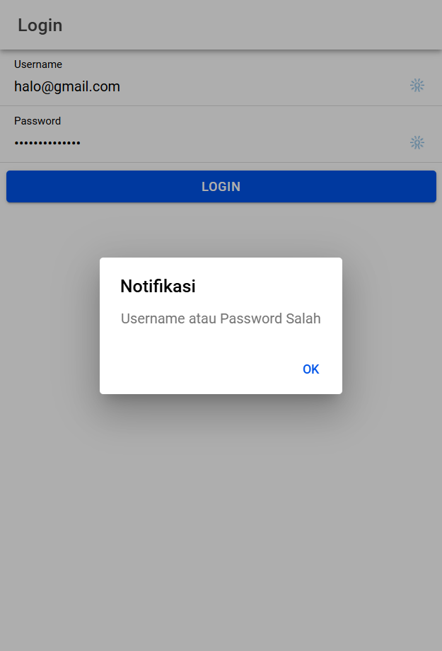

# Tugas 7 - Pertemuan 8

- **Nama** : Luthfi Arie Zulfikri
- **NIM** : H1D022061
- **Shift Lama** : A
- **Shift Baru** : A

---

# Cara Kerja Login

- User membuka aplikasi dan diarahkan ke halaman login (`app/login/login.page.html`) jika belum login atau belum terautentikasi.
- User memasukkan `username` dan `password` pada form login yang sudah disediakan.
- Ketika user menekan tombol "Login", fungsi `login()` di `login.page.ts` akan dijalankan.
- Fungsi `login()` memeriksa apakah `username` dan `password` sudah terisi. Jika tidak, aplikasi menampilkan notifikasi bahwa kedua kolom tersebut tidak boleh kosong.
- Jika data login valid, aplikasi mengirimkan data `username` dan `password` menggunakan fungsi `postMethod()` di `AuthenticationService`.
- Data tersebut dikirim ke endpoint API `login.php` pada server.
- Server merespons permintaan login dengan mengembalikan status login (`status_login`) dan data token.
- Jika login berhasil (`status_login` berisi `"berhasil"`), server juga mengirimkan `token` dan `username`.
- Jika login berhasil, fungsi `saveData()` menyimpan `token` dan `username` ke perangkat menggunakan `Capacitor Preferences`.
- Nilai `isAuthenticated` pada `AuthenticationService` diperbarui menjadi `true` dan aplikasi mengarahkan user ke halaman `home`.
- Jika login gagal (`status_login` tidak mengandung `"berhasil"`), aplikasi menampilkan pesan kesalahan “Username atau Password Salah”.
- Ketika user berhasil login, mereka diarahkan ke halaman `home.page.html`, yang menampilkan `Selamat datang` beserta nama user.
- Halaman ini dilindungi oleh `authGuard` sehingga hanya user yang sudah terautentikasi dapat mengaksesnya.
- Di halaman `home`, user dapat logout dengan memilih opsi "Logout".
- Fungsi `logout()` di `HomePage` memanggil `clearData()` di `AuthenticationService`, yang menghapus token dan data user.
- User kemudian diarahkan kembali ke halaman `login`.
- Saat user membuka aplikasi dan masih terautentikasi, `autoLoginGuard` akan secara otomatis mengarahkan user ke halaman `home` tanpa harus login ulang.

---

# Screenshot

  
  

  

